```{r setup, include=FALSE}
knitr::opts_chunk$set(echo = FALSE)

library(knitr)
```

## Cell Biology {.slide}

### 5 lectures + background reading (Campbell)

1. Cell structure (chapter 7)
2. Cell membranes (chapter 8)
3. **Cell division (chapter 12)**
4. Respiration (chapter 10)
5. Photosynthesis (chapter 11)

## Cell division

- Growth
- Tissue renewal
- Reproduction, asexual
- Reproduction, sexual (meiosis -different process)
- All require replication of DNA

## DNA organisation

- Genome comprised of multiple chromosomes
- Long linear DNA and associated proteins, together these form chromatin
- Chromosomes contain genes and non-coding DNA

## Human genome

- 22 x 2 Autosomes (diploid)
- Sex chromosomes x 2 (XX or XY)
- 46 chromosomes in total
- 7,200,000,000 bp (7.2 Gb, haploid size 3.6 Gb)
- 20-25,000 genes 
- All copied with each cell division

## Paradox of genome size

- Genome size and (apparent) complexity are not correlated
- Axolotl 32 Gb
- Norway pine 68 Gb
- Lungfish 130 Gb
- Amoeba dubia 690 Gb

```{r, out.width = "100%", fig.align='center'}
include_graphics("./img/bigG.svg")
```

## Composition of human genome

```{r, out.width = "65%", fig.align='center'}
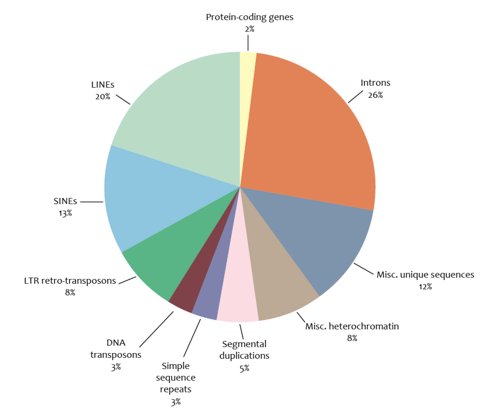
```

## Retrotransposons as an example {.flex-cols}

- DNA elements with copy/paste functionality
- LINES, SINES, LTR retrotransposons (includes ERVs)
- Typically encode enzymes, e.g. reverse transcriptase (copy) and integrase (paste)
- Mutations cause loss of function over time “viral graveyard”
- ~50% human genome
- Most do not serve a purpose for the organism = Junk DNA

```{r, out.width = "100%", fig.align='center'}

```

## Bacterial genomes {.flex-cols}

- Little junk DNA
- E.g. *E. coli* 4.6 Mbp, 4,288 genes, mean intergenic distance only 118 bp
- Few introns
- Genome size and gene content highly correlated
- Genome size and ecology correlated: free living > pathogens or symbionts

```{r, out.width = "100%", fig.align='center'}
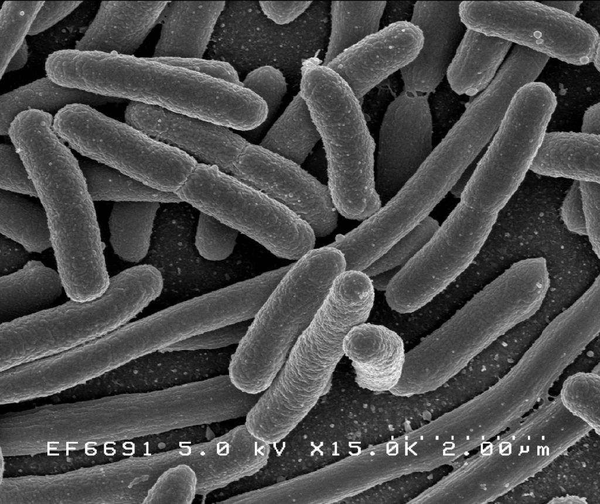
```

## Graur et al. 2013

```{r, out.width = "100%", fig.align='center', out.height=500}
include_graphics("./img/Graur et al. - 2013.pdf")
```

## Chromosome duplication

- After duplication, sister chromatids are closely attached at centromeres by cohesins
- Repetitive DNA in central region of chromosome
- Section either side of centromere is the chromosome arm
- Sister chromatids separate during mitosis

```{r, out.width = "70%", fig.align='right'}
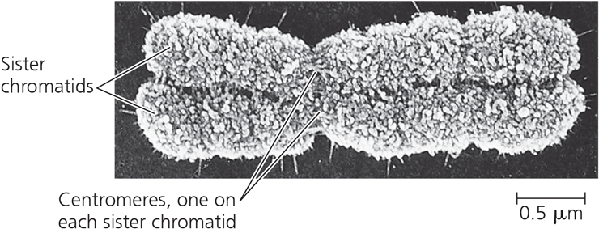
```

## Cell cycle {.columns-2}

- Interphase
- G1 phase (metabolism, growth)
- S phase (DNA synthesis)
- G2 phase (metabolism, growth, prepare for mitosis)
- Mitotic phase (M phase)
- Mitosis (formation of daughter nuclei, 5 stages)
- Cytokinesis (cell division)

```{r, out.width = "100%", fig.align='center'}
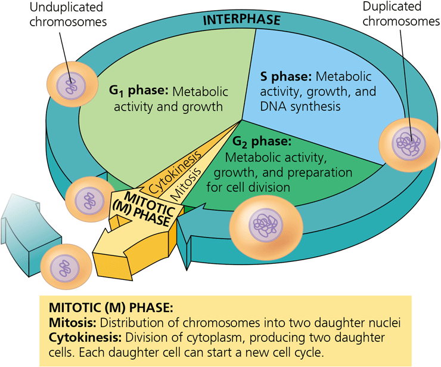
```

## Many human cells take 24hrs {.columns-2}

- Interphase
- G1 phase: 5-6 hours (highly variable)
- S phase: 10-12 hours
- G2 phase: 4-6 hours
- Mitotic phase (M phase): < 1 hour
- Mitosis
- Cytokinesis 

```{r, out.width = "100%", fig.align='center'}

```

## *Clostridium*: 10 minutes

```{r, out.width = "90%", fig.align='center'}
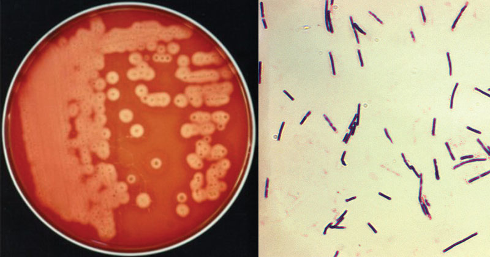
```

## Yeast: 90 minutes

```{r, out.width = "70%", fig.align='center'}
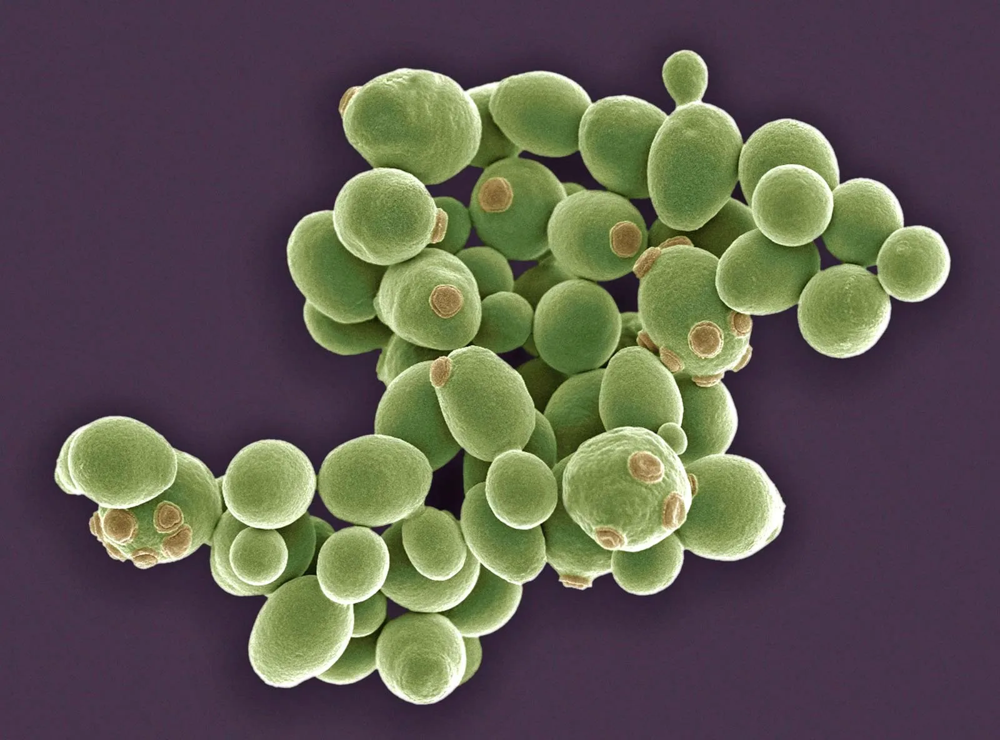
```

## Neurons: whole life

```{r, out.width = "90%", fig.align='center'}
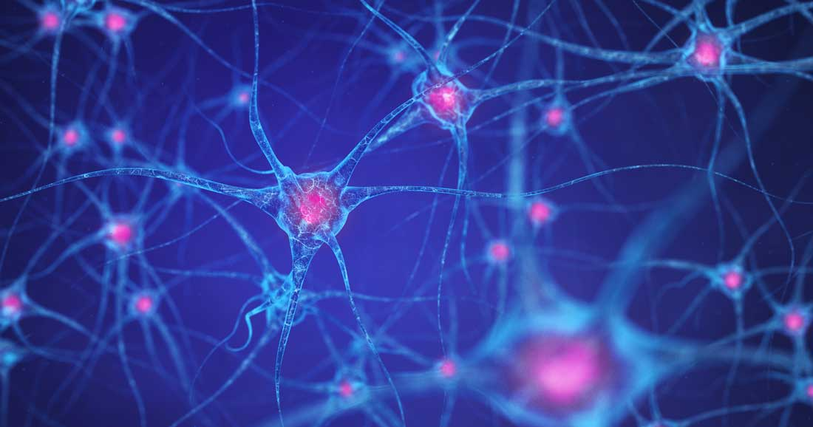
```

## Stages of mitosis {.columns-2}

- Prophase
- Prometaphase
- Metaphase
- Anaphase
- Telophase 

```{r, out.width = "100%", fig.align='center'}

```

## Mitotic spindle

- Begins to form in prophase
- Crucial for mitosis
- Formed from microtubules from cytoskeleton
- Attached to two centrosomes

## Mitotic spindle

```{r, out.width = "85%", fig.align='center'}

```

## Prophase {.columns-2 .white-slide}

- Chromatin condenses
- Sister chromatids visible with light microscope
- Mitotic spindle begins to form
- Centrosomes move away from one another

```{r, out.width = "80%", fig.align='center'}
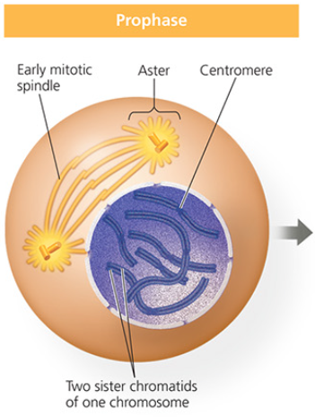
```

## Prometaphase {.columns-2 .white-slide}

- Nuclear envelope fragments
- Microtubules of mitotic spindle enter nuclear area
- Kinetochores form around centrosomes
- Attach to microtubules

```{r, out.width = "80%", fig.align='center'}
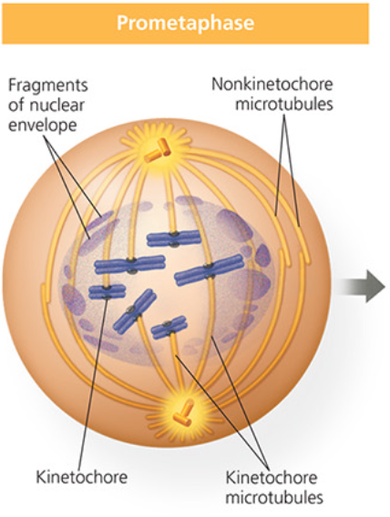
```

## Metaphase {.columns-2 .white-slide}

- Centrosomes of mitotic spindle now at opposite ends of cell
- Chromosomes at metaphase plate, equidistant from centrosomes

```{r, out.width = "80%", fig.align='center'}
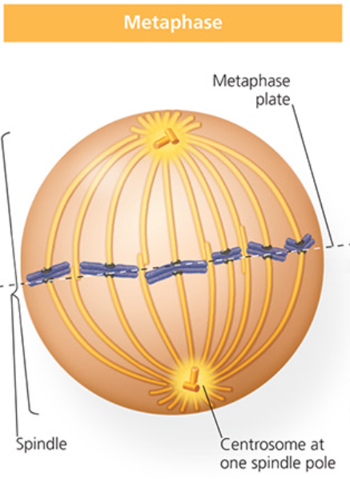
```

## Anaphase {.columns-2 .white-slide}

- Cohesin is cleaved, sister chromatids separate
- Chromosomes pulled towards opposite ends of cell
- Cell elongates

```{r, out.width = "80%", fig.align='center'}
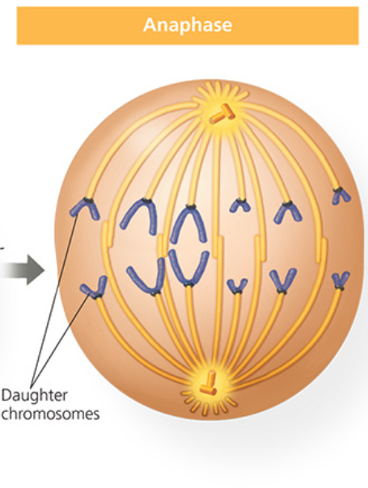
```

## Telophase {.columns-2 .white-slide}

- Daughter nuclei and nuclear envelopes form
- Cytokinesis (division of cytoplasm) overlaps with telophase
- Cleavage furrow pinches cell in two

```{r, out.width = "80%", fig.align='center'}
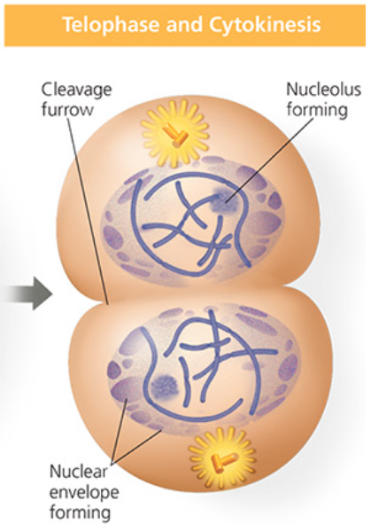
```

## Mitosis overview

```{r, out.width = "100%", fig.align='center'}
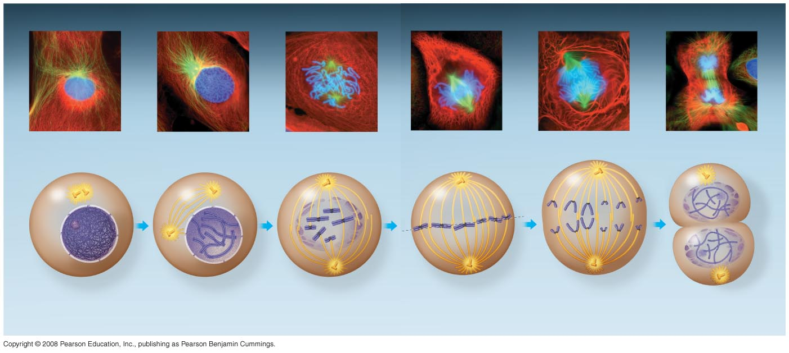
```

## Cytokinesis

- Animal cells undergo cleavage, along the cleavage furrow
- Plant cells rely on formation of a cell plate 
- Cell plate grows and fuses to plasma membrane
- Cell walls between daughter cells form

## Cytokinesis {.white-slide}

```{r, out.width = "100%", fig.align='center'}
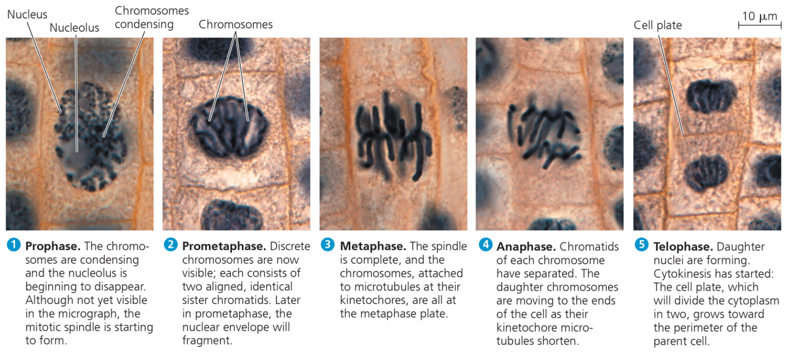
```

## Cell cycle control {.white-slide}

```{r, out.width = "60%", fig.align='center'}
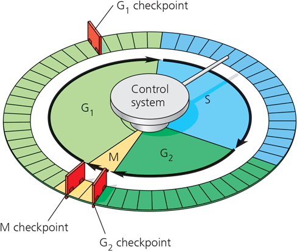
```

## Checkpoints

```{r, out.width = "85%", fig.align='center'}

```

## Cancer cells

- Continuously divide
- Breakdown in cell cycle control and checkpoints
- Caused by mutation in key gene(s)
- Tumour formation
- Divide indefinitely in culture (20-50x for normal cells)

## Henrietta Lacks (1951)

```{r, out.width = "100%", fig.align='center'}
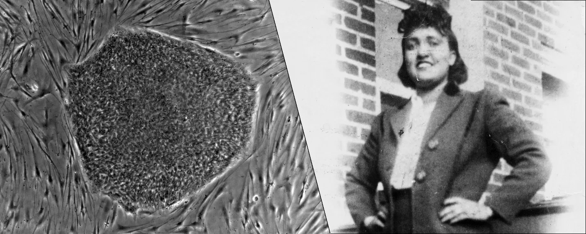
```

## Cell Biology

### 5 lectures + background reading (Campbell)

1. Cell structure (chapter 7)
2. Cell membranes (chapter 8)
3. **Cell division (chapter 12)**
4. Respiration (chapter 10)
5. Photosynthesis (chapter 11)

# Next time: Respiration

### Dr. Axel Barlow: a.barlow@bangor.ac.uk
